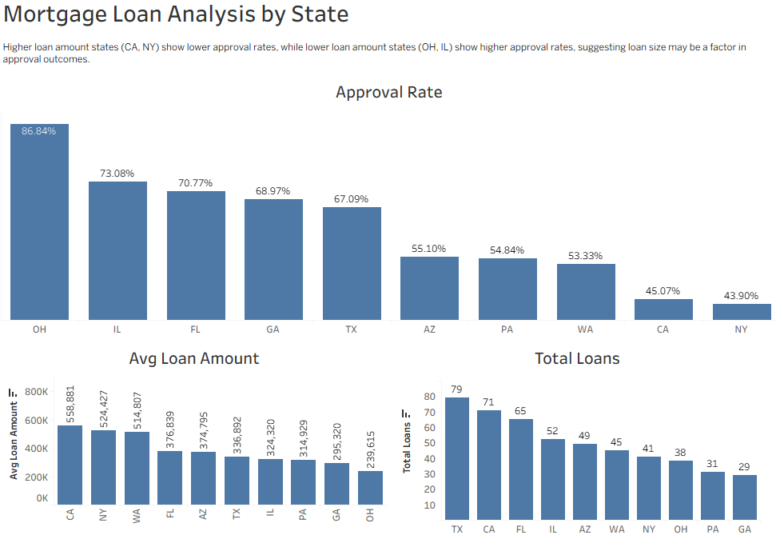

# Mortgage Loan Analysis

This project analyzes mortgage loan data using SQL (MySQL) and Tableau to identify trends in loan approvals, loan amounts, and loan volume across states.

---

## 🔧 Tools Used
- MySQL (data cleaning & analysis)
- Tableau (data visualization)

---

## 📁 Project Overview

1. Cleaned and standardized raw mortgage data:
   - Loan_Status
   - Employment_Status
   - State

2. Built SQL queries to analyze:
   - Approval rates by state
   - Average loan amount by state
   - Total loan volume by state

3. Developed a Tableau dashboard to visualize key metrics and support analysis

---

## 📈 Key Insight

States with higher average loan amounts (CA, NY) show lower approval rates, while lower loan amount states (OH, IL) show higher approval rates, indicating that loan size may be a factor in approval outcomes.

---

## 📊 Dashboard

